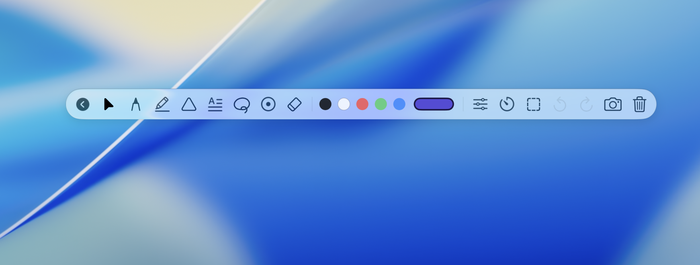

# Gaze Screen Annotation Utility

<p align="center">
  
</p>

A high-performance macOS screen annotation utility built with SwiftUI and AppKit. Specially engineered for teachers, presenters, and developers, Gaze is optimized for pen tablets with professional ink smoothing, stabilization, and multi-display setups.

## 📥 Direct Download

For a quick setup, you can download the pre-compiled version of the app directly:

👉 **[Download Gaze.zip](https://github.com/glitchmxn/Gaze/raw/main/Gaze.zip)** (Extract the ZIP file and drag `Gaze.app` into your Applications folder).

> [!NOTE]
> As the app is not signed with an official Apple Developer certificate, the first time you open it, you may need to right-click `Gaze.app` and choose **Open**, or navigate to **System Settings > Privacy & Security** and select **Open Anyway**.

---

## 🚀 Core Features

### 🎛️ Glassmorphic Floating Toolbar & Edge Snapping
* **Adaptive Edge Docking**: Drag the toolbar near any edge of your screen, and it will snap cleanly to the left, right, top, or bottom.
* **Compact Layout Switch**: The layout dynamically adjusts (switching between horizontal and vertical) depending on where it is docked, conserving valuable screen real estate.
* **Micro-Animations & Hover Effects**: Adaptive light/dark mode toolbar with clean hover interactions and haptic feedback profiles.

### ⏱️ Detachable Floating Timer & Stopwatch
* **Detachable HUD**: Drag the timer panel away from the toolbar to position it anywhere on your desktop.
* **Stopwatch with Laps**: Switch modes to record lap split intervals on the fly.
* **Interactive Alert Profiles**: Set timers with customizable warning behaviors, audible alarm cues, and canvas-edge flash overlays when time runs out.

### 🖋️ Professional Vector Ink Engine
* **Spline Interpolation**: Real-time Catmull-Rom spline math renders drawing strokes with beautiful, natural curves.
* **Weighted Moving Average (WMA) Stabilization**: Smooths out hand jitters for clean lines when using pen tablets or mouse inputs.
* **Proportional Stroke Width Scaling**: Resizing vector shapes automatically scales stroke widths to keep layouts proportional.
* **Built-in Geometric Shapes**: Draw precise vector shapes including rectangles (with rounded corners support), circles, triangles, straight lines, and arrows.

### 📐 Selection, Lasso & Smart Text Inputs
* **Lasso & Vector Selection**: Select, drag, resize, rotate, or re-order (Bring to Front / Send to Back) any annotation on the canvas.
* **Direct Text Editor**: Click anywhere or double-click an existing text selection to type notes directly on screen.
* **App Interaction Override**: Hold the `⌥ + ⇧` (Option + Shift) hotkey at any time to temporarily suspend drawing mode, allowing you to click and interact with applications beneath your overlay annotations without losing your work.
* **Intelligent Focus Detection**: Automatically pauses global hotkeys while you type to support natural keyboard symbols, and resumes instantly when editing completes.

### 📋 Canvas Mode & Live Navigator Map
* **Bound-Limited Canvas Space**: Transitions from normal desktop annotations to an expanded 8,000 x 8,000 pt virtual drawing board (approx. 40-50 screenfuls of workspace) to prevent getting lost in empty coordinates.
* **Interactive Live Navigator Map (Mini-Map)**: Keep track of your virtual canvas with a glassmorphic Mini-Map featuring real-time drawing replication, dynamic viewport panning, and a quick zoom reset.
* **Proportional Multi-Screen Mirroring**: Synchronize annotations dynamically across multiple displays with custom scaling modes (`Aspect Fit`, `Aspect Fill`, or `Absolute`) and unified click/erase coordinate tracking.


### 📸 Smart Screenshots & PDF Exports
* **Precision Region Capture**: Capture full screen or select custom crop-regions.
* **Canvas-Only Export**: Save drawings against transparent backgrounds (ignoring background desktop apps) for clean documentation.
* **Vector PDF Export**: Export drawings losslessly to high-quality PDF files. Choose between saving directly to the **Desktop** or the **Downloads** directory depending on your preference.
* **Zero-Spills Pipe Redirection**: Background screenshot processing runs asynchronously without blocking the main drawing threads.

---

## ⌨️ Keyboard Shortcuts & Global Hotkeys

Gaze registers global hotkeys to switch tools and perform actions instantly from any application:

| Category | Action | Shortcut |
| :--- | :--- | :--- |
| **Tool Selection** | Cursor / Selection Interaction | `⌥ + 1` |
| | Pencil Drawing Tool | `⌥ + 2` |
| | Highlighter Tool | `⌥ + 3` |
| | Text Box Tool | `⌥ + 4` |
| | Lasso / Selection Mode | `⌥ + 5` |
| | Laser Pointer Tool | `⌥ + 6` |
| | Eraser Brush | `⌥ + 7` |
| **Shape Selection**| Square Shape | `⌥ + ⌘ + 1` |
| | Circle Shape | `⌥ + ⌘ + 2` |
| | Triangle Shape | `⌥ + ⌘ + 3` |
| | Line Shape | `⌥ + ⌘ + 4` |
| | Arrow Shape | `⌥ + ⌘ + 5` |
| **Editing** | Undo Stroke | `⌥ + 8` |
| | Redo Stroke | `⌥ + 9` |
| | Delete Selected Element | `⌘ + ⇧ + K` |
| | Clear Screen | `⌥ + -` |
| **Utility Controls**| Toggle Canvas Mode | `⌥ + 0` |
| | Toggle Toolbar Visibility | `⌥ + Q` |
| | Toggle Timer / Stopwatch | `⌥ + ⌘ + T` |
| | Detach / Attach Timer HUD | `⌥ + ⌘ + J` |
| | Smart Screenshot Capture | `⌥ + ⌘ + C` |
| | Toggle Multi-Screen Mirroring| `⌥ + ⌘ + M` |
| **Interaction** | Temporary App Interaction Mode | **Hold** `⌥ + ⇧` |

---

## ⚡ Performance Engineering (Zero CPU Spikes)

Gaze runs at a solid **60/120fps (ProMotion)** with sub-millisecond CPU overhead through several key optimizations:

1. **Pre-compiled Path Caching**: Flat uniform-pressure strokes are cached as a single `Path`, bypassing the expensive segment-by-segment spline calculation on redraw cycles.
2. **Conditional Compositing Layers**: Offscreen transparency layers (`context.drawLayer`) are only created when rendering transparent elements (like highlighters). Opaque elements are rendered directly on the main context.
3. **Single-Pass Laser Trail**: Trail spline control points are computed exactly once per frame and shared across both the neon glow and core overlay layers.
4. **Batched Mutations**: Drawing and selection updates are processed as single-pass mutated arrays, minimizing Swift UI publisher (`@Published`) updates.

---

## 🛠️ Getting Started

### Open in Xcode
1. Double-click **`Gaze.xcodeproj`**.
2. Select the **Gaze** target and **My Mac** in the scheme selector.
3. Press **Cmd + R** to build and run.

### Running Unit & Performance Tests
To run the automated test suite:
```bash
xcodebuild test -scheme Gaze -destination 'platform=macOS,arch=arm64'
```
